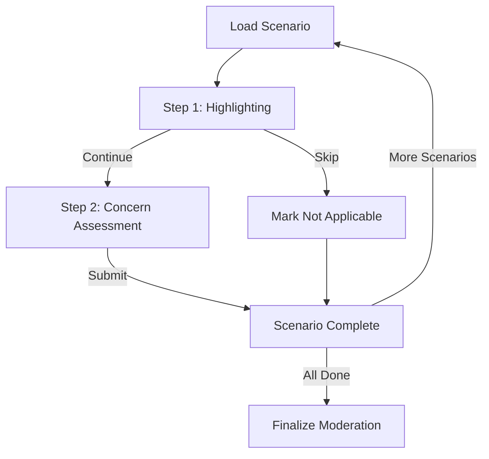

# Moderation Survey Flow Documentation

## Overview

The moderation survey flow allows parents to review AI responses to child prompts and apply moderation strategies. This document outlines how questions are selected, how moderation decisions are made, and where data is saved.

## 1. Question/Scenario Selection Flow

### Scenario Sources

- **Personality-based scenarios**: Generated from child profile characteristics using `generateScenariosFromPersonalityData()` in `src/lib/data/personalityQuestions.ts` (primary source)
- **Custom scenario**: User-created scenario option (always appears last)

**Note**: Hardcoded default scenarios have been deprecated and are no longer used. The system now relies entirely on personality-based scenarios generated from child profile characteristics. The old hardcoded scenarios (previously at lines 80-92 in `moderation-scenario/+page.svelte`) have been commented out.

### Scenario Selection Process

**Backend Endpoint**: `GET /moderation/scenarios/available`

- Location: `backend/open_webui/routers/moderation_scenarios.py` (lines 168-221)
- Returns unseen scenario indices (0-11) for the current session
- Filters out scenarios already seen by the user for the given child_id
- Randomly shuffles available scenarios

**Frontend Flow** (`moderation-scenario/+page.svelte`):

1. On mount (lines 1962-2311):
   - Loads child profiles via `loadChildProfiles()` (line 500)
   - For Prolific users: Fetches available scenarios from backend (lines 2055-2109)
   - Generates personality-based scenarios via `generatePersonalityScenarios()` (line 546)
   - Applies attention check marker to one random scenario (line 317)
   - Ensures custom scenario is always last (line 301)

2. Scenario Package Persistence:
   - Scenarios are packaged and stored in localStorage with key `scenarioPkg_{childId}_{sessionNumber}`
   - Package includes: version, childId, sessionNumber, list of [question, response] pairs, createdAt
   - Once locked for a session, scenarios don't regenerate (prevents re-ordering)

3. Scenario List Building:
   - Base scenarios come exclusively from personality data (no fallback to hardcoded defaults)
   - Attention check is randomly injected into one response (line 317)
   - Custom scenario is appended at the end (line 301)

## 2. Moderation Decision Tree Flow

### UI Panels and Visibility

The moderation workflow uses two main panels that control the user experience:

#### 1. Initial Decision Pane (`showInitialDecisionPane`)

**Purpose**: Simplified 2-step identification-only workflow

> **Note (Feb 2026):** The flow was originally 4 steps (Highlight → Comprehension → Judgment → Decision), then reduced to 3 steps (Highlight → Assess → Decide), and is now a **2-step identification-only experiment** (Highlight → Assess). Step 3 (moderation/satisfaction) is defined in the `ScenarioState` type but **disabled at runtime**. See code comments for restoration instructions.

**Visibility Conditions**:

- Shown when: `!step2Completed && !markedNotApplicable && (initialDecisionStep >= 1 && initialDecisionStep <= 2) && (!isCustomScenario || customScenarioGenerated)`
- Hidden when:
  - Step 2 is completed (`step2Completed === true`)
  - Scenario is marked as not applicable (`markedNotApplicable === true`)
  - Scenario is in an end state (completed or skipped)
  - Custom scenario hasn't been generated yet

**States**:

- **Step 1**: Highlighting mode - User can drag to highlight concerning text
- **Step 2**: Concern assessment - User rates concern level (1-5 Likert scale) and provides a reason. This is the **final active step**; completing it finishes the scenario.

#### 2. Moderation Panel (`moderationPanelVisible`)

**Status**: Currently **disabled** as part of the simplified 2-step flow. The panel code exists but is not reachable in the active workflow.

### 2-Step Simplified Flow (Current)

The moderation workflow currently follows a 2-step identification-only process:

#### Step 1: Highlighting (`initialDecisionStep === 1`)

**Function**: `completeStep1(skipped: boolean)`

**Actions**:

- User can drag to highlight concerning text in prompt or response
- Highlights stored in `highlightedTexts1` array
- Text selections automatically saved to `/selections` endpoint
- User can skip highlighting and proceed, or mark scenario as not applicable

**Completion**:

- `completeStep1(skipped: false)`: Proceeds to Step 2, saves highlights to backend
- `completeStep1(skipped: true)`: Marks as not applicable, skips all remaining steps

**Endpoints**:

- `POST /selections` - Save highlighted text selections
- `POST /moderation/sessions` - Save highlights with `version_number: 0`

**Data Saved**:

- `highlighted_texts`: Array of highlighted phrases
- `initial_decision`: `undefined` (no decision yet) or `'not_applicable'` (if skipped)

#### Step 2: Concern Assessment (`initialDecisionStep === 2`)

**Function**: `completeStep2()`

**Actions**:

- User answers two questions:
  - `concernLevel`: 1-5 Likert scale (concern level)
  - `concernReason`: Free-text explanation ("Why?")
- `concernLevel` is required to proceed

**Completion**:

- `completeStep2()`: Validates concern level, saves to backend, **completes the scenario**

**Endpoints**:

- `POST /moderation/sessions` - Save concern assessment data

**Data Saved**:

- `concern_level`: 1-5 number (direct column)
- `session_metadata.concern_reason`: Free-text explanation

#### Step 3: Satisfaction Check — DISABLED

**Status**: Defined in `ScenarioState` type but disabled at runtime. The step logic is commented out with restoration instructions.

**Fields (exist in type but are not used)**:

- `satisfactionLevel`: 1-5 Likert scale
- `satisfactionReason`: Free-text
- `nextAction`: `'try_again' | 'move_on' | null`

### Removed Fields (Historical)

The following fields were removed from `ScenarioState` in earlier refactors:

- `childAccomplish` — "What is the child trying to accomplish?" (removed: no longer collected)
- `assistantDoing` — "What is the GenAI Chatbot mainly doing?" (removed: no longer collected)
- `wouldShowChild` — "Would you show this to your child?" yes/no (removed: migration `84b2215f7772` dropped the column)
- `step4Completed` — Step 4 completion flag (removed: flow reduced from 4 to 3, then to 2 steps)
- `initialDecisionStep: 1 | 2 | 3 | 4` — Now derived reactively from completion flags, not stored

## 3. Data Persistence Flow

### Frontend State Management

**Local Storage Keys** (child-specific):

- `moderationScenarioStates_{childId}`: Map of scenario index -> ScenarioState
- `moderationScenarioTimers_{childId}`: Map of scenario index -> time in seconds
- `moderationCurrentScenario_{childId}`: Current scenario index
- `scenarioPkg_{childId}_{sessionNumber}`: Canonical scenario package

**ScenarioState Interface** (current):

```typescript
interface ScenarioState {
	// Version management
	versions: ModerationVersion[];
	currentVersionIndex: number;
	confirmedVersionIndex: number | null;

	// Highlighting
	highlightedTexts1: HighlightInfo[];

	// Strategy selection
	selectedModerations: Set<string>;
	customInstructions: Array<{ id: string; text: string }>;

	// UI state
	showOriginal1: boolean;
	showComparisonView: boolean;
	markedNotApplicable: boolean;

	// Attention check
	attentionCheckSelected: boolean;
	attentionCheckPassed: boolean;
	attentionCheckStep1Passed: boolean; // analytics only
	attentionCheckStep2Passed: boolean; // analytics only
	attentionCheckStep3Passed: boolean; // analytics only

	// Step completion (2-step active flow; step 3 disabled)
	step1Completed: boolean;
	step2Completed: boolean;
	step3Completed: boolean; // present in type but disabled at runtime

	// Step 2: Concern assessment
	concernLevel: number | null; // 1-5 Likert scale
	concernReason: string; // free-text "Why?"

	// Step 3: Satisfaction check (DISABLED)
	satisfactionLevel: number | null; // 1-5
	satisfactionReason: string;
	nextAction: 'try_again' | 'move_on' | null;

	// Backend identifiers
	assignment_id?: string;
	scenario_id?: string;
	assignmentStarted?: boolean;
	responseHighlightedHTML?: string;
	promptHighlightedHTML?: string;

	// Custom scenario
	customPrompt?: string;
}
```

> **Removed fields** (no longer in the interface): `hasInitialDecision`, `acceptedOriginal`, `initialDecisionStep`, `step4Completed`, `childAccomplish`, `assistantDoing`, `wouldShowChild`, `initialDecisionChoice`, `reflectionFeeling`, `reflectionReason`.

### Completion States

A scenario is **completed** when any of the following conditions are met:

- `markedNotApplicable === true` (skipped)
- `step2Completed === true` (concern assessment submitted — this is the final active step)

### Backend Database Schema

**Table**: `moderation_session`

- Location: `backend/open_webui/models/moderation.py` (lines 12-53)
- Key fields:
  - `scenario_index`: Which scenario (0-based)
  - `attempt_number`: Usually 1
  - `version_number`: Increments for each moderated version (0 = original decision)
  - `session_number`: Session identifier
  - `initial_decision`: 'accept_original' | 'moderate' | 'not_applicable'
  - `is_final_version`: Boolean marking final choice
  - `strategies`: JSON array of strategy names
  - `custom_instructions`: JSON array of custom instruction texts
  - `highlighted_texts`: JSON array of highlighted phrases
  - `refactored_response`: Final moderated response text
  - `session_metadata`: JSON object with:
    - `child_accomplish`: Step 2 comprehension check answer
    - `assistant_doing`: Step 2 comprehension check answer
    - `decision`: Final decision type ('accept_original', 'moderate', 'not_applicable')
    - `decided_at`: Timestamp when decision was made
    - `highlights_saved_at`: Timestamp when highlights were saved
    - `saved_at`: Timestamp when step data was saved

### Save Operations

**Immediate Saves** (via `saveModerationSession()`):

1. **Step 1** (`completeStep1()`):
   - When skipped: Saves `initial_decision='not_applicable'`, `version_number: 0`
   - When continued: Saves `highlighted_texts` only, `version_number: 0`

2. **Step 2** (`completeStep2()`):
   - Saves `concern_level` to DIRECT COLUMN
   - Saves `concern_reason` to `session_metadata`
   - Updates `version_number: 0` row
   - Preserves highlights from Step 1
   - **This is the final active step** — completing it finishes the scenario

3. **Step 3** (DISABLED):
   - Would save `satisfactionLevel`, `satisfactionReason`, `nextAction`
   - Code is commented out; see source for restoration instructions

4. **Mark Not Applicable** (`markNotApplicable()` or `completeStep1(skipped: true)`):
   - Saves `initial_decision='not_applicable'` + all step data (if completed)
   - Sets all step completion flags to true

5. **State persistence** (`saveCurrentScenarioState()`):
   - Saves to localStorage on every state change
   - Reactive statement triggers on key state changes

**Finalization** (`finalizeModeration()` - line 1936):

- Endpoint: `POST /workflow/moderation/finalize`
- Location: `backend/open_webui/routers/workflow.py` (lines 382-435)
- Called when user completes all scenarios and proceeds to exit survey
- Groups sessions by (child_id, scenario_index, attempt_number, session_number)
- Marks the latest created row as `is_final_version: true` for each scenario
- Clears `is_final_version` on all other versions for that scenario

### Session Activity Tracking

**Endpoint**: `POST /moderation/session-activity`

- Location: `backend/open_webui/routers/moderation_scenarios.py` (lines 96-115)
- Tracks active time spent on moderation session
- Syncs every 30 seconds (line 239)
- Uses idle threshold of 60 seconds (line 207)

## 4. Attention Check Flow

**Detection**:

- One scenario randomly selected to have attention check marker appended to response
- Marker: `<!--ATTN-CHECK-->`
- `isAttentionCheckScenario` reactive variable detects the marker

**Behavior (non-blocking — users can proceed regardless)**:

- Attention check pass/fail is tracked for analytics only; it does NOT block progress
- `attentionCheckStep1Passed`: Tracks if user highlighted anything (Step 1)
- `attentionCheckStep2Passed`: Tracks if user entered appropriate content (Step 2)
- `attentionCheckStep3Passed`: Tracks if user selected "I read the instructions" from the Attention Check dropdown
- `attentionCheckPassed = step1 && step2 && step3` — overall pass/fail for analytics

- When user selects "I read the instructions" from the Attention Check dropdown:
  1. Immediately saves attention check as passed to backend (`attention_check_passed: true`)
  2. Sets completion flags and closes panels
  3. Automatically navigates to next scenario after 1 second delay
  4. Shows success message: "✓ Passed attention check! Moving to next scenario..."

- Tracks: `attention_check_selected`, `attention_check_passed` in database
- State persists when navigating back — scenario shows as completed

**Endpoint**: `POST /moderation/sessions`

- `is_attention_check`: true
- `attention_check_selected`: true
- `attention_check_passed`: true

## 5. Custom Scenario Flow

**Generation** (`generateCustomScenarioResponse()` - line 1070):

- User enters custom prompt (minimum 10 characters)
- Calls `/moderation/apply` with empty strategies to generate baseline response
- Response becomes the "original_response" for moderation
- Custom prompt stored in `scenarioState.customPrompt`
- Treated like any other scenario after generation — goes through same 2-step flow

**Endpoint**: `POST /moderation/apply`

- `moderation_types`: [] (empty - just generate response)
- `child_prompt`: User's custom prompt

## 6. Backend API Endpoints

### Session Management

1. **Create/Update Session**: `POST /moderation/sessions`
   - Creates or updates a moderation session version row
   - Version identified by: `(user_id, child_id, scenario_index, attempt_number, version_number, session_number)`
   - `scenario_id` is now included with every payload; the client backs it with the canonical
     scenario identifier returned from `/moderation/scenarios/assign` or a fallback
     `"scenario_<index>"` when unavailable. The backend also backfills missing values when
     rows are created.
   - Used for all step saves and version creation
   - Location: `backend/open_webui/routers/moderation_scenarios.py` (line 50)

2. **List Sessions**: `GET /moderation/sessions?child_id={child_id}`
   - Returns all sessions for user, optionally filtered by child_id
   - Location: `backend/open_webui/routers/moderation_scenarios.py` (line 122)

3. **Get Session**: `GET /moderation/sessions/{session_id}`
   - Returns specific session by ID
   - Location: `backend/open_webui/routers/moderation_scenarios.py` (line 136)

4. **Delete Session**: `DELETE /moderation/sessions/{session_id}`
   - Deletes a session
   - Location: `backend/open_webui/routers/moderation_scenarios.py` (line 154)

### Moderation

5. **Apply Moderation**: `POST /moderation/apply`
   - Generates moderated response using selected strategies
   - Returns: `refactored_response`, `system_prompt_rule`, `moderation_types`
   - Location: `backend/open_webui/routers/moderation.py` (line 32)
   - Uses: `multi_moderations_openai()` in `backend/open_webui/utils/moderation.py`

### Scenarios

6. **Get Available Scenarios**: `GET /moderation/scenarios/available?child_id={child_id}`
   - Returns unseen scenario indices for current session
   - Filters out scenarios already seen by user
   - Location: `backend/open_webui/routers/moderation_scenarios.py` (line 172)

### Activity Tracking

7. **Post Session Activity**: `POST /moderation/session-activity`
   - Tracks active time spent on moderation session
   - Syncs every 30 seconds
   - Uses idle threshold of 60 seconds
   - Location: `backend/open_webui/routers/moderation_scenarios.py` (line 100)

### Finalization

8. **Finalize Moderation**: `POST /workflow/moderation/finalize`
   - Marks latest version as `is_final_version: true` for each scenario
   - Groups by: `(child_id, scenario_index, attempt_number, session_number)`
   - Called when user completes all scenarios
   - Location: `backend/open_webui/routers/workflow.py` (line 382)

## Key Files Reference

- **Frontend Main Component**: `src/routes/(app)/moderation-scenario/+page.svelte`
- **Backend Session Router**: `backend/open_webui/routers/moderation_scenarios.py`
- **Backend Moderation Router**: `backend/open_webui/routers/moderation.py`
- **Moderation Utils**: `backend/open_webui/utils/moderation.py`
- **Database Models**: `backend/open_webui/models/moderation.py`
- **Workflow Router**: `backend/open_webui/routers/workflow.py` (finalization)
- **API Client**: `src/lib/apis/moderation/index.ts`

## Flow Diagram



> **Note:** Step 3 (moderation/satisfaction) is disabled. The diagram shows the active 2-step flow. See `ScenarioState` type for the disabled step fields.

## Scenario Endpoints

### 1. Mark Not Applicable

**Function**: `markNotApplicable()` or `completeStep1(skipped: true)`

**Flow**:

1. Sets `markedNotApplicable = true`
2. Sets all step completion flags to true
3. Closes panels
4. Saves to backend with `initial_decision: 'not_applicable'`

**Endpoint**: `POST /moderation/sessions`

- `version_number`: 0
- `initial_decision`: 'not_applicable'

### 2. Complete Concern Assessment (Step 2)

**Function**: `completeStep2()`

**Flow**:

1. Validates `concernLevel` is selected (1-5)
2. Sets `step2Completed = true`
3. Saves to backend with concern data
4. Scenario is now complete

**Endpoint**: `POST /moderation/sessions`

- `version_number`: 0
- `concern_level`: 1-5 number
- `session_metadata.concern_reason`: Free-text explanation

### Historical: Accept Original / Moderate / Confirm Version

> These endpoints were part of the 4-step and 3-step flows that are now disabled.
> `acceptOriginalResponse()` was removed — users can no longer accept original responses.
> `confirmCurrentVersion()` and `applySelectedModerations()` exist in code but are unreachable in the current 2-step flow.
