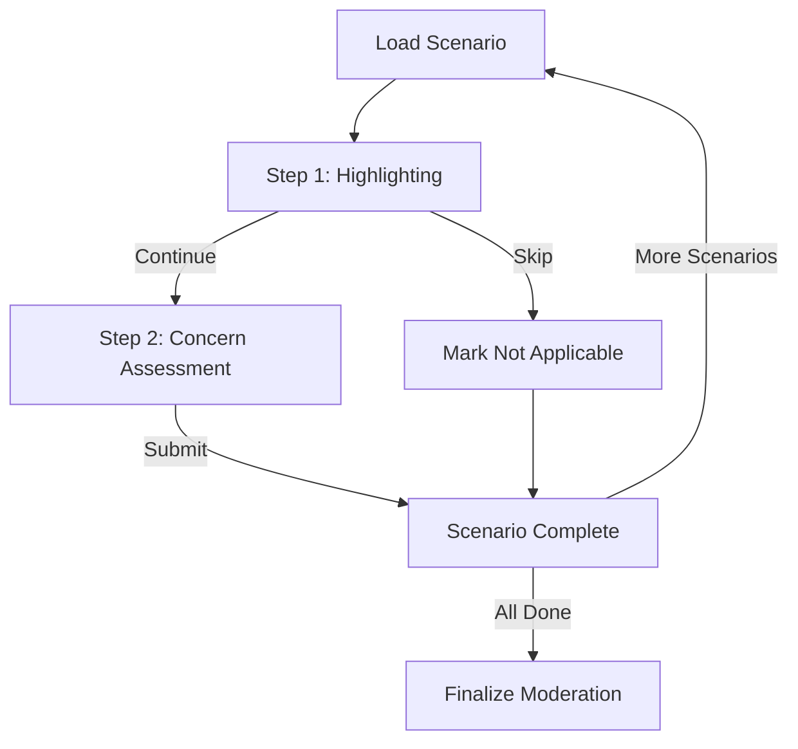

# Moderation Survey Flow Documentation

## Overview

The moderation survey flow allows parents to review AI responses to child prompts and apply moderation strategies. This document outlines how questions are selected, how moderation decisions are made, and where data is saved.

## 1. Question/Scenario Selection Flow

### Scenario Sources

Scenarios come from the `scenarios` database table (managed via the admin panel). There are no hardcoded or personality-generated scenarios — the pool is entirely DB-backed.

- **Regular scenarios**: Drawn from the `scenarios` table via weighted sampling (`POST /moderation/scenarios/assign`).
- **Attention check slot**: One position per session is injected with an attention check; the expected code is stored in `attention_check_code` on the `scenario_assignments` row.
- **Custom scenario**: User-created option (always appears last); not assigned via the weighted-sampling endpoint.

### Scenario Assignment Process

**Frontend Flow** (`moderation-scenario/+page.svelte`):

1. On mount, the component:
   - Calls `fetchWorkflowStateForModeration()` → reads `/workflow/state` to restore the `moderationFinalized` flag only (not full scenario state).
   - Fetches `currentAttemptNumber` via `getCurrentAttempt()`.
   - Calls `getAssignmentsForChild(childId, attemptNumber)` to fetch any existing `scenario_assignments` rows for this child at the current `attempt_number`.
   - Existing-assignment restore uses current-attempt rows including `assigned`, `started`, `completed`, and `skipped` so revisits restore the existing package instead of creating new assignments.
   - For any unfilled slots (up to `SCENARIOS_PER_SESSION`, default 6), calls `assignScenario()` which POSTs to `/moderation/scenarios/assign`.
   - **No `workflow_draft` is read for scenario state.** Per-scenario state is restored inside `loadScenario()` from `getModerationSessions()` (backend DB), with the in-memory `scenarioStates` Map as a session-only fallback for same-session navigation.
2. Each `assignScenario()` call returns `assignment_id`, `scenario_id`, `prompt_text`, `response_text`, and optionally `attention_check_code`.
3. The resulting `scenarioList` array and `scenarioIdentifiers` (assignment IDs) are locked for the session.

**Backend Endpoint**: `POST /moderation/scenarios/assign`

- Location: `backend/open_webui/routers/moderation_scenarios.py`
- Performs weighted sampling: `p(s) ∝ 1/(n_assigned + 1)^α` — favors less-seen scenarios.
- Creates a `scenario_assignments` row with `status='assigned'` and increments `scenarios.n_assigned` in one transaction.
- On unique-conflict races, retries assignment and returns `409` if conflicts persist.

**`SCENARIOS_PER_SESSION`**: Configurable in Admin → Scenarios → Study Configuration (default: 6).

## 2. Moderation Decision Tree Flow

### UI Panels and Visibility

The moderation workflow uses two main panels that control the user experience:

#### 1. Initial Decision Pane (`showInitialDecisionPane`)

**Purpose**: Simplified 2-step identification-only workflow

> **Note (Feb 2026):** The flow was originally 4 steps (Highlight → Comprehension → Judgment → Decision), then reduced to 3 steps (Highlight → Assess → Decide), and is now a **2-step identification-only experiment** (Highlight → Assess). Step 3 (moderation/satisfaction) is defined in the `ScenarioState` type but **disabled at runtime**. See code comments for restoration instructions.

**Visibility Conditions**:

- Shown when: `!step2Completed && !markedNotApplicable && (initialDecisionStep >= 1 && initialDecisionStep <= 2) && (!isCustomScenario || customScenarioGenerated)`
- Hidden when:
  - Step 2 is completed (`step2Completed === true`)
  - Scenario is marked as not applicable (`markedNotApplicable === true`)
  - Scenario is in an end state (completed or skipped)
  - Custom scenario hasn't been generated yet

**States**:

- **Step 1**: Highlighting mode - User can drag to highlight concerning text
- **Step 2**: Concern assessment - User rates concern level (1-5 Likert scale) and provides a reason. This is the **final active step**; completing it finishes the scenario.

#### 2. Moderation Panel (`moderationPanelVisible`)

**Status**: Currently **disabled** as part of the simplified 2-step flow. The panel code exists but is not reachable in the active workflow.

### 2-Step Simplified Flow (Current)

The moderation workflow currently follows a 2-step identification-only process:

#### Step 1: Highlighting (`initialDecisionStep === 1`)

**Function**: `completeStep1(skipped: boolean)`

**Actions**:

- User can drag to highlight concerning text in prompt or response
- Highlights stored in `highlightedTexts1` array
- Text selections automatically saved to `/selections` endpoint
- User can skip highlighting and proceed, or mark scenario as not applicable

**Completion**:

- `completeStep1(skipped: false)`: Proceeds to Step 2, saves highlights to backend
- `completeStep1(skipped: true)`: Marks as not applicable, skips all remaining steps

**Endpoints**:

- `POST /selections` - Save highlighted text selections
- `POST /moderation/sessions` - Save highlights with `version_number: 0`

**Data Saved**:

- `highlighted_texts`: Array of highlighted phrase objects (text, start_offset, end_offset)
- `response_highlighted_html`: Raw HTML with `<mark>` elements for the response pane
- `prompt_highlighted_html`: Raw HTML with `<mark>` elements for the prompt pane
- `initial_decision`: `undefined` (no decision yet) or `'not_applicable'` (if skipped)

#### Step 2: Concern Mapping (`initialDecisionStep === 2`)

**Function**: `completeStep2()`

**Actions**:

Step 2 uses the Concern Mapping model. For each highlighted passage the parent must:

1. Add one or more free-text concern descriptions to a shared per-scenario pool (`concernMappings[]`).
2. Link each highlight to at least one concern (`highlightConcerns` map: `Record<highlight_text, concern_id[]>`).
3. Assign a 1–5 Likert severity rating to every concern in the pool.

Submission is blocked until: every highlight has at least one linked concern, every concern has a rating, and every concern in the pool is linked to at least one highlight.

**Completion**:

`completeStep2()`:

1. Calls `POST /moderation/concern-items/batch` to persist the full concern pool to the `concern_item` table.
2. Calls `POST /moderation/sessions` with concern summary data and `initial_decision='moderate'`.
3. Calls `POST /moderation/scenarios/complete` to set `status='completed'` on the assignment row.
4. Sets `step2Completed = true`.

**Endpoints**:

- `POST /moderation/concern-items/batch` — Batch-saves all concern items (canonical concern data)
- `POST /moderation/sessions` — Saves concern summary to session row
- `POST /moderation/scenarios/complete` — Marks assignment as completed, computes `issue_any`

**Data Saved**:

- `concern_item` table: one row per concern with `text`, `concern_level`, `assignment_id`, session identifiers
- `concern_level` (direct column on `moderation_session`): **max** of all per-concern ratings (backward compat)
- `concern_reason` (direct column): derived concatenated string of all concern texts (backward compat)
- `session_metadata.highlight_concerns`: the `highlightConcerns` map for analyst join-back

#### Step 3: Satisfaction Check — DISABLED

**Status**: Defined in `ScenarioState` type but disabled at runtime. The step logic is commented out with restoration instructions.

**Fields (exist in type but are not used)**:

- `satisfactionLevel`: 1-5 Likert scale
- `satisfactionReason`: Free-text
- `nextAction`: `'try_again' | 'move_on' | null`

### Removed Fields (Historical)

The following fields were removed from `ScenarioState` in earlier refactors:

- `childAccomplish` — "What is the child trying to accomplish?" (removed: no longer collected)
- `assistantDoing` — "What is the GenAI Chatbot mainly doing?" (removed: no longer collected)
- `wouldShowChild` — "Would you show this to your child?" yes/no (removed: migration `84b2215f7772` dropped the column)
- `step4Completed` — Step 4 completion flag (removed: flow reduced from 4 to 3, then to 2 steps)
- `initialDecisionStep: 1 | 2 | 3 | 4` — Now derived reactively from completion flags, not stored

## 3. Data Persistence Flow

### Frontend State Management

**In-memory state** (primary, session-scoped):

- `scenarioStates: Map<string, ScenarioState>` — keyed by assignment ID; holds per-scenario UI state for the current page session. Populated/updated by `saveCurrentScenarioState()`. Not persisted to localStorage or backend draft.
- On page reload / navigation, state is restored from the backend DB (`getModerationSessions()`) inside `loadScenario()`, not from localStorage or `workflow_draft`.

**`workflow_draft` usage** (minimal):

- Written only by `proceedToNextStep()` with `{ moderation_finalized: true }` when the user completes all scenarios and navigates to the exit survey.
- Read by `fetchWorkflowStateForModeration()` at mount to restore the `moderationFinalized` flag.
- Deleted on workflow reset (`deleteWorkflowDraft()`).
- **Not** used for scenario state, selected moderations, highlights, or any other per-scenario data.

### Draft Keying Safety (April 2026)

To prevent stale content from appearing on Scenario 0 after resets/reloads:

- Draft restore no longer falls back to numeric index keys (for example, `"0"`).
- Autosave is skipped unless a stable assignment-backed scenario identifier exists.
- Workflow reset sets `isLoadingScenario = true` before clearing state to suppress reactive autosave races during regeneration.

> **Removed (March 2026):** The localStorage keys `moderationScenarioStates_{childId}`, `moderationScenarioTimers_{childId}`, `moderationCurrentScenario_{childId}`, and the `scenarioPkg_{childId}_{sessionNumber}` package are no longer written. The hybrid localStorage + backend draft merge system (`restoreFromLocalStorageIfMissing`, `loadSavedStates`, `backendProvided` Set) has been removed in favour of the backend-primary restore approach.

**ScenarioState Interface** (current):

```typescript
interface ScenarioState {
	// Version management
	versions: ModerationVersion[];
	currentVersionIndex: number;
	confirmedVersionIndex: number | null;

	// Highlighting
	highlightedTexts1: HighlightInfo[];

	// Strategy selection
	selectedModerations: Set<string>;
	customInstructions: Array<{ id: string; text: string }>;

	// UI state
	showOriginal1: boolean;
	showComparisonView: boolean;
	markedNotApplicable: boolean;

	// Attention check
	attentionCheckSelected: boolean;
	attentionCheckPassed: boolean;
	attentionCheckStep1Passed: boolean; // analytics only
	attentionCheckStep2Passed: boolean; // analytics only
	attentionCheckStep3Passed: boolean; // analytics only

	// Step completion (2-step active flow; step 3 disabled)
	step1Completed: boolean;
	step2Completed: boolean;
	step3Completed: boolean; // present in type but disabled at runtime

	// Step 2: Concern assessment
	concernLevel: number | null; // 1-5 Likert scale
	concernReason: string; // free-text "Why?"

	// Step 3: Satisfaction check (DISABLED)
	satisfactionLevel: number | null; // 1-5
	satisfactionReason: string;
	nextAction: 'try_again' | 'move_on' | null;

	// Backend identifiers
	assignment_id?: string;
	scenario_id?: string;
	assignmentStarted?: boolean;
	responseHighlightedHTML?: string;
	promptHighlightedHTML?: string;

	// Custom scenario
	customPrompt?: string;
}
```

> **Removed fields** (no longer in the interface): `hasInitialDecision`, `acceptedOriginal`, `initialDecisionStep`, `step4Completed`, `childAccomplish`, `assistantDoing`, `wouldShowChild`, `initialDecisionChoice`, `reflectionFeeling`, `reflectionReason`.

### Completion States

A scenario is **completed** when any of the following conditions are met:

- `markedNotApplicable === true` (skipped)
- `step2Completed === true` (concern assessment submitted — this is the final active step)

### Backend Database Schema

**Table**: `moderation_session`

- Location: `backend/open_webui/models/moderation.py` (lines 12-53)
- Key fields:
  - `scenario_index`: Which scenario (0-based)
  - `attempt_number`: Usually 1
  - `version_number`: Increments for each moderated version (0 = original decision)
  - `session_number`: Session identifier
  - `initial_decision`: 'accept_original' | 'moderate' | 'not_applicable'
  - `is_final_version`: Boolean marking final choice
  - `strategies`: JSON array of strategy names
  - `custom_instructions`: JSON array of custom instruction texts
  - `highlighted_texts`: JSON array of highlighted phrase objects (text, start_offset, end_offset)
  - `response_highlighted_html`: HTML string with `<mark>` elements for the response pane (added in migration `aa11bb22cc44`)
  - `prompt_highlighted_html`: HTML string with `<mark>` elements for the prompt pane (added in migration `aa11bb22cc44`)
  - `concern_level`: Max per-concern Likert rating (1–5); backward-compat aggregate
  - `concern_reason`: Derived concatenated concern text; backward-compat string
  - `refactored_response`: Final moderated response text (unused in current 2-step flow)
  - `session_metadata`: JSON object with:
    - `highlight_concerns`: Map of highlight text → concern IDs (Concern Mapping join key)
    - `decision`: Final decision type ('accept_original', 'moderate', 'not_applicable')
    - `decided_at`: Timestamp when decision was made
    - `highlights_saved_at`: Timestamp when highlights were saved
    - `saved_at`: Timestamp when step data was saved

### Save Operations

**Immediate Saves** (via `saveModerationSession()`):

1. **Step 1** (`completeStep1()`):
   - When skipped: Saves `initial_decision='not_applicable'`, `version_number: 0`
   - When continued: Saves `highlighted_texts` only, `version_number: 0`

2. **Step 2** (`completeStep2()`):
   - `POST /moderation/concern-items/batch` — saves full concern pool to `concern_item` table (canonical)
   - `POST /moderation/sessions` — saves `concern_level` (max rating), `concern_reason` (derived), `session_metadata.highlight_concerns`
   - `POST /moderation/scenarios/complete` — sets `status='completed'`, computes `issue_any`
   - **This is the final active step** — completing it finishes the scenario

3. **Step 3** (DISABLED):
   - Would save `satisfactionLevel`, `satisfactionReason`, `nextAction`
   - Code is commented out; see source for restoration instructions

4. **Mark Not Applicable** (`markNotApplicable()` or `completeStep1(skipped: true)`):
   - Saves `initial_decision='not_applicable'` + all step data (if completed)
   - Sets all step completion flags to true

5. **State persistence** (`saveCurrentScenarioState()`):
   - Updates the in-memory `scenarioStates` Map only — no backend write, no localStorage write.
   - The reactive auto-save block has been removed. State is only durably persisted to the backend at step-completion boundaries (Steps 1 and 2) and at finalization.

**Finalization** (`finalizeModeration()` - line 1936):

- Endpoint: `POST /workflow/moderation/finalize`
- Location: `backend/open_webui/routers/workflow.py` (lines 382-435)
- Called when user completes all scenarios and proceeds to exit survey
- Groups sessions by (child_id, scenario_index, attempt_number, session_number)
- Marks the latest created row as `is_final_version: true` for each scenario
- Clears `is_final_version` on all other versions for that scenario

### Session Activity Tracking

**Endpoint**: `POST /moderation/session-activity`

- Location: `backend/open_webui/routers/moderation_scenarios.py` (lines 96-115)
- Tracks active time spent on moderation session
- Syncs every 30 seconds (line 239)
- Uses idle threshold of 60 seconds (line 207)

## 4. Attention Check Flow

**Assignment**:

- One slot per session is designated as the attention check at assignment time.
- `assignScenario()` returns `attention_check_code` (a short string) on the assignment row for the designated slot.
- No separate API call is needed — the code is embedded in the `scenario_assignments` record.

**Content-match normalization**:

- `loadScenario()` uses a `stripAttentionSuffix` helper to strip the `\n\n[Attention code: ...]` suffix from `original_response` before comparing to the DB session's stored response. This ensures that attention-check scenarios saved before the suffix was introduced correctly match their existing `moderation_session` row and restore `markedNotApplicable = true`.

**UI**:

- `AttentionCheckBar.svelte` is rendered for the attention check scenario.
- It accepts a `code` prop (the expected value — never displayed to the participant) and emits a `submit` event with the user's entry.
- The parent page compares the entry to `attention_check_code` to determine pass/fail.

**Behavior (non-blocking — users can proceed regardless)**:

- Attention check pass/fail is tracked for analytics only; it does NOT block progress.
- `attentionCheckPassed` — overall pass/fail flag stored in `ScenarioState` and persisted to the backend.
- State persists when navigating back — scenario shows as completed.

**Endpoint**: `POST /moderation/sessions`

- `is_attention_check`: true
- `attention_check_passed`: true/false

## 5. Custom Scenario Flow

**Generation** (`generateCustomScenarioResponse()` - line 1070):

- User enters custom prompt (minimum 10 characters)
- Calls `/moderation/apply` with empty strategies to generate baseline response
- Response becomes the "original_response" for moderation
- Custom prompt stored in `scenarioState.customPrompt`
- Treated like any other scenario after generation — goes through same 2-step flow

**Endpoint**: `POST /moderation/apply`

- `moderation_types`: [] (empty - just generate response)
- `child_prompt`: User's custom prompt

## 6. Backend API Endpoints

### Session Management

1. **Create/Update Session**: `POST /moderation/sessions`
   - Creates or updates a moderation session version row
   - Version identified by: `(user_id, child_id, scenario_index, attempt_number, version_number, session_number)`
   - `scenario_id` is now included with every payload; the client backs it with the canonical
     scenario identifier returned from `/moderation/scenarios/assign` or a fallback
     `"scenario_<index>"` when unavailable. The backend also backfills missing values when
     rows are created.
   - Used for all step saves and version creation
   - Location: `backend/open_webui/routers/moderation_scenarios.py` (line 50)

2. **List Sessions**: `GET /moderation/sessions?child_id={child_id}`
   - Returns all sessions for user, optionally filtered by child_id
   - Location: `backend/open_webui/routers/moderation_scenarios.py` (line 122)

3. **Get Session**: `GET /moderation/sessions/{session_id}`
   - Returns specific session by ID
   - Location: `backend/open_webui/routers/moderation_scenarios.py` (line 136)

4. **Delete Session**: `DELETE /moderation/sessions/{session_id}`
   - Deletes a session
   - Location: `backend/open_webui/routers/moderation_scenarios.py` (line 154)

### Moderation

5. **Apply Moderation**: `POST /moderation/apply`
   - Generates moderated response using selected strategies
   - Returns: `refactored_response`, `system_prompt_rule`, `moderation_types`
   - Location: `backend/open_webui/routers/moderation.py` (line 32)
   - Uses: `multi_moderations_openai()` in `backend/open_webui/utils/moderation.py`

### Scenarios

6. **Assign Scenario**: `POST /moderation/scenarios/assign`
   - Performs weighted sampling and creates a `scenario_assignments` row with `status='assigned'`
   - Returns `assignment_id`, `scenario_id`, prompt/response text, and optional `attention_check_code`
   - Location: `backend/open_webui/routers/moderation_scenarios.py`

6a. **Concern Items Batch Save**: `POST /moderation/concern-items/batch`

- Persists the full per-scenario concern pool to the `concern_item` table
- Called at end of Step 2 before `POST /moderation/sessions`
- Location: `backend/open_webui/routers/moderation_scenarios.py`

### Activity Tracking

7. **Post Session Activity**: `POST /moderation/session-activity`
   - Tracks active time spent on moderation session
   - Syncs every 30 seconds
   - Uses idle threshold of 60 seconds
   - Location: `backend/open_webui/routers/moderation_scenarios.py` (line 100)

### Finalization

8. **Finalize Moderation**: `POST /workflow/moderation/finalize`
   - Marks latest version as `is_final_version: true` for each scenario
   - Groups by: `(child_id, scenario_index, attempt_number, session_number)`
   - Called when user completes all scenarios
   - Location: `backend/open_webui/routers/workflow.py` (line 382)

## Key Files Reference

- **Frontend Main Component**: `src/routes/(app)/moderation-scenario/+page.svelte`
- **Backend Session Router**: `backend/open_webui/routers/moderation_scenarios.py`
- **Backend Moderation Router**: `backend/open_webui/routers/moderation.py`
- **Moderation Utils**: `backend/open_webui/utils/moderation.py`
- **Database Models**: `backend/open_webui/models/moderation.py`
- **Workflow Router**: `backend/open_webui/routers/workflow.py` (finalization)
- **API Client**: `src/lib/apis/moderation/index.ts`

## Flow Diagram



> **Note:** Step 3 (moderation/satisfaction) is disabled. The diagram shows the active 2-step flow. See `ScenarioState` type for the disabled step fields.

## Scenario Endpoints

### 1. Mark Not Applicable

**Function**: `markNotApplicable()` or `completeStep1(skipped: true)`

**Flow**:

1. Sets `markedNotApplicable = true`
2. Sets all step completion flags to true
3. Closes panels
4. Saves to backend with `initial_decision: 'not_applicable'`

**Endpoint**: `POST /moderation/sessions`

- `version_number`: 0
- `initial_decision`: 'not_applicable'

### 2. Complete Concern Mapping (Step 2)

**Function**: `completeStep2()`

**Flow**:

1. Validates: every highlight has a linked concern, every concern has a rating, every concern is linked.
2. Calls `POST /moderation/concern-items/batch` with the full concern pool.
3. Sets `step2Completed = true`, saves session row and completes assignment.

**Endpoints**:

- `POST /moderation/concern-items/batch` — concern pool (canonical)
- `POST /moderation/sessions` — session summary (`concern_level` = max rating, `concern_reason` = derived string, `session_metadata.highlight_concerns`)
- `POST /moderation/scenarios/complete` — `issue_any` computed from highlight count

### Historical: Accept Original / Moderate / Confirm Version

> These endpoints were part of the 4-step and 3-step flows that are now disabled.
> `acceptOriginalResponse()` was removed — users can no longer accept original responses.
> `confirmCurrentVersion()` and `applySelectedModerations()` exist in code but are unreachable in the current 2-step flow.
